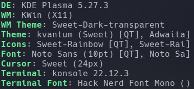

## 🌸 dotfiles
<details>

### :penguin: DE/WM


- #### Dependencies

```sh
sudo zypper ar http://dl.google.com/linux/chrome/rpm/stable/x86_64 google-chrome
sudo zypper ar -cfp 90 'https://download.opensuse.org/repositories/home:/opensuse_zh/openSUSE_Tumbleweed/' opensuse_zh
sudo zypper ar -cfp 90 'https://ftp.gwdg.de/pub/linux/misc/packman/suse/openSUSE_Tumbleweed/' packman
sudo zypper dist-upgrade --from packman --allow-vendor-change
sudo zypper install --from packman ffmpeg gstreamer-plugins-{good,bad,ugly,libav} libavcodec-full vlc-codecs

// python latest instead
sudo zypper in kvantum devilspie2 fcitx5 latte-dock git zsh autojump jq httpie python310 yakuake kitty foliate \
pipewire pipewire-alsa pipewire-aptx pipewire-pulseaudio pipewire-spa-tools pipewire-tools wireplumber opi

systemctl --user stop pulseaudio.{service,socket}
systemctl --user disable pulseaudio.{service,socket}
systemctl --user start wireplumber
systemctl --user start pipewire-pulse.service

chsh -s /bin/zsh
sh -c "$(wget -O- https://raw.githubusercontent.com/ohmyzsh/ohmyzsh/master/tools/install.sh)"
git clone https://github.com/jeffreytse/zsh-vi-mode ~/.oh-my-zsh/custom/plugins/zsh-vi-mode
git clone https://github.com/gpakosz/.tmux.git .oh-my-tmux
ln -s -f ~/.oh-my-tmux/.tmux.conf ~/.tmux.config

python3 -m pip install tldr
python3 -m pip install konsave
// oh my posh
wget https://github.com/JanDeDobbeleer/oh-my-posh/releases/latest/download/posh-linux-amd64 -O ~/bin/oh-my-posh
sudo chmod +x ~/bin/oh-my-posh
mkdir ~/.poshthemes
wget https://github.com/JanDeDobbeleer/oh-my-posh/releases/latest/download/themes.zip -O ~/.poshthemes/themes.zip
unzip ~/.poshthemes/themes.zip -d ~/.poshthemes
chmod u+rw ~/.poshthemes/*.omp.*
rm ~/.poshthemes/themes.zip

systemctl --user restart clash.service
```
get latest [clash](https://github.com/Dreamacro/clash/releases)

for hyprland, build dependencies from source:
  cliphist hyprpicker swaylock-effects wlogout hyprpaper pistol Waybar
  xdg-desktop-portal-hyprland

- #### Settings
```text
kvantummanager > apply Sweet-transparent-toolbar
kdesu kvantummanager > apply Sweet-transparent-toolbar(for yast2)

System Settings > Appearance  > Global Theme       > Sweet
                              > Application Style  > kvantum
                              > Plasma Style       > Sweet
                              > Colors             > Sweet
                              > Window Decorations > Sweet-Dark-Transparent
                              > Icons              > Sweet-Rainbow + candy-icons
                              > Cursors            > Sweet-cursors
                              > Splash Screen      > Sweet
                              > Font               > Noto Sans + Hack
                > Window Management > Kwin Script  > Force Blur + Krohnkite
                > Shortcuts > Kwin > Import Scheme ? kwin_custom_shortcut
                > Workspace Behavior > Desktop Effects > Translucency

Discover > search and install widgets: fokus, todolist, advancedradio, eventcalendar,
Latte SideBar Button, Window Title Applet, Latte Separator, Better inline Clock, Window Buttons Applet
```

```sh
cp ~/.local/share/kwin/scripts/forceblur/metadata.desktop ~/.local/share/kservices5/forceblur.desktop
ln -s ~/.local/share/kwin/scripts/krohnkite/metadata.desktop ~/.local/share/kservices5/krohnkite.desktop
fc-cache -rv
git clone https://github.com/psifidotos/applet-latte-sidebar-button.git ~/Download/
cd ~/Download/applet-latte-sidebar-button
plasmapkg2 -i .
git clone https://github.com/wsdfhjxc/virtual-desktop-bar.git ~/Download/
cd ~/Download/virtual-desktop-bar
./scripts/install-dependencies-opensuse.sh
./scripts/install-applet.sh
```

### :duck: Tools

```sh
zypper info -t pattern devel_basis
sudo zypper in -t pattern devel_basis
//zypper info -t pattern devel_kernel
sudo zypper in vim neovim emacs emacs-nox emacs-x11 yq xmlformat tidy stylua clang shfmt shellcheck
git clone https://github.com/NvChad/NvChad ~/.config/nvim --depth 1
git clone https://github.com/syndbg/goenv.git ~/.goenv
// go latest instead
goenv install 1.20.3
go install golang.org/x/tools/gopls@latest
curl https://sh.rustup.rs -sSf | sh -s -- --default-toolchain stable
rustup component add rust-analyzer --toolchain stable
ln -s ~/.rustup/toolchains/stable-x86_64-unknown-linux-gnu/bin/rust-analyzer ~/.cargo/bin
```

### :hatching_chick: Usage

```sh
//chezmoi init --apply $liwiwd
chezmoi init https://github.com/liwiwd/dotfiles.git
chezmoi diff
chezmoi apply -v
```
[chezmoi quick start](https://www.chezmoi.io/quick-start/#using-chezmoi-across-multiple-machines)

## :grapes: TODO
config with shell script
## :cherries: Credits

© [Sweet KDE](https://store.kde.org/p/1294174)
© [Moe Layout](https://store.kde.org/p/1373008)
© [NvChad](https://nvchad.com/)

